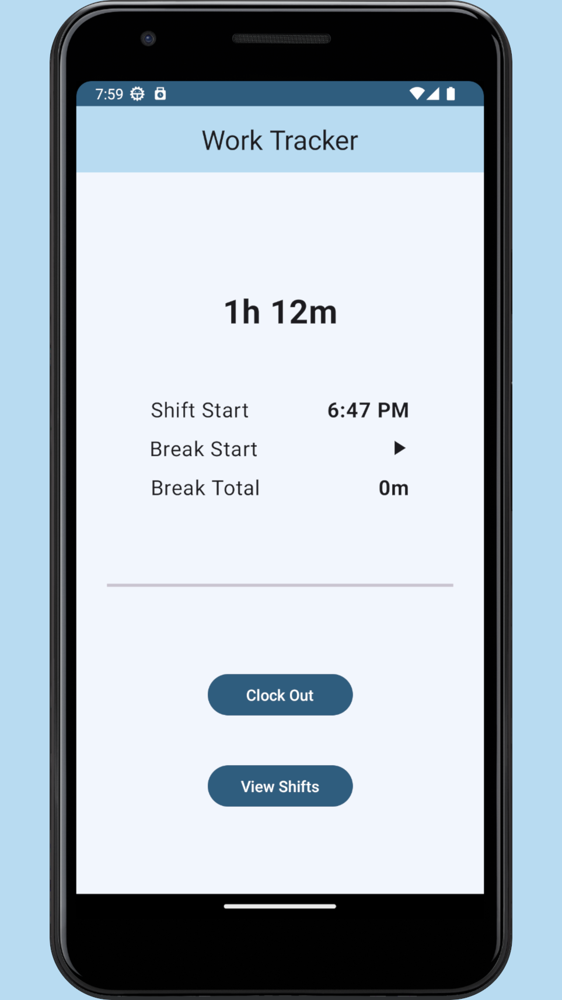
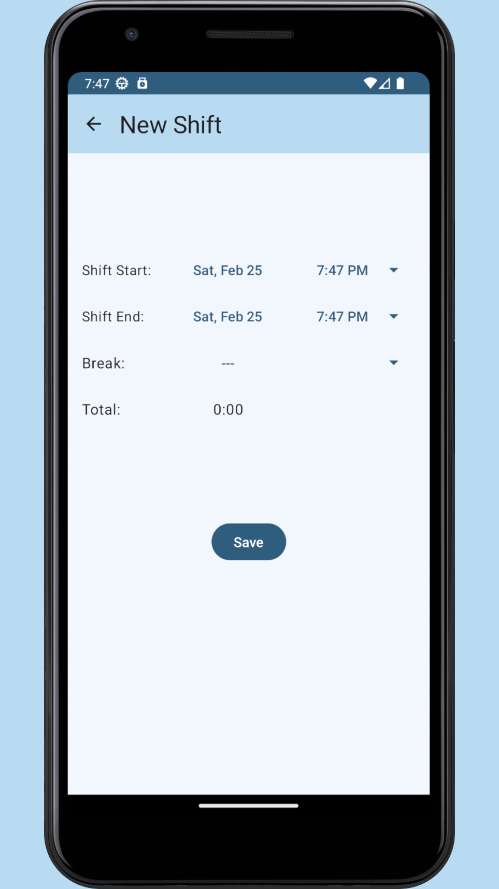

# Work Tracker

Work Tracker is a comprehensive and user-friendly app designed to help you keep a record of your work hours. With its intuitive interface, you can effortlessly log in and out of your shift, no matter where you are. Whether you're clocking in at the office or logging your hours from home, the app has got you covered.

The app accurately tracks the time you spend working and generates detailed reports on your work hours, so you can keep a record of your daily, weekly, and monthly hours worked. With Work Tracker, you'll never have to worry about losing track of your hours or misplacing manual time sheets.

  
  

